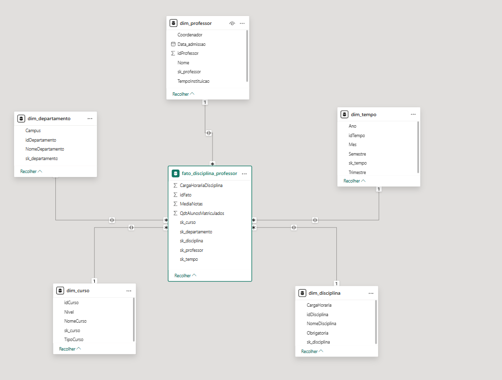

# Desafio de Projeto: Modelagem Dimensional (Star Schema)

Este projeto faz parte do desafio de modelagem de dados da **DIO**, onde o objetivo foi transformar um modelo relacional (ER) em um modelo dimensional (**Star Schema**) com foco na análise de dados de professores universitários.

## 🎯 Objetivo do Desafio

Criar um diagrama dimensional com base em um diagrama relacional pré-existente, focando no **Professor** como objeto central da análise.

**Requisitos:**
* Montar o esquema em estrela (Star Schema).
* A tabela Fato deve refletir dados sobre o professor, cursos ministrados e departamentos.
* Não incluir dados sobre alunos individualmente, apenas métricas agregadas.
* Criar uma dimensão de datas (`dim_tempo`) para possibilitar análises temporais.

## 📐 O Modelo Dimensional (Solução)

A solução foi desenvolvida seguindo a metodologia Star Schema, resultando na seguinte estrutura:

### 1. Tabela Fato: `fato_disciplina_professor`
Esta é a tabela central que armazena as métricas e as chaves estrangeiras (Surrogate Keys - SK) para as dimensões. Cada linha representa uma disciplina ministrada por um professor em um determinado período.

* **Métricas (Medidas):**
    * `CargaHorariaDisciplina`: Carga horária total da disciplina ministrada.
    * `MediaNotas`: Média das notas obtidas na disciplina (indicador de desempenho/exigência).
    * `QtdAlunosMatriculados`: Total de alunos na turma (indicador de volume).
* **Chaves (FKs):**
    * `sk_professor`, `sk_curso`, `sk_departamento`, `sk_disciplina`, `sk_tempo`.

### 2. Tabelas Dimensão
As dimensões fornecem o contexto descritivo para analisar os fatos.

* **`dim_professor`:** Contém os dados dos docentes.
    * Atributos: `Nome`, `Data_admissao`, `Coordenador` (flag indicando se é coordenador), `TempoInstituicao`.
* **`dim_departamento`:** Contextualiza onde o professor está alocado.
    * Atributos: `NomeDepartamento`, `Campus`.
* **`dim_curso`:** Define em qual curso a aula foi ministrada.
    * Atributos: `NomeCurso`, `Nivel` (Bacharelado, Mestrado, etc.), `TipoCurso`.
* **`dim_disciplina`:** Detalhes sobre a matéria ensinada.
    * Atributos: `NomeDisciplina`, `CargaHoraria`, `Obrigatoria` (Sim/Não).
* **`dim_tempo`:** Dimensão auxiliar criada para permitir cortes temporais (Slicing & Dicing).
    * Atributos: `Ano`, `Mes`, `Semestre`, `Trimestre`.
    * *Nota:* Esta tabela foi criada conforme solicitado no desafio, assumindo a existência de datas de oferta das disciplinas.

## 🧠 Decisões de Modelagem

* **Granularidade:** A granularidade da tabela fato é definida por **Professor ministrando uma Disciplina em um Período de Tempo**.
* **Relacionamentos:** Foram utilizados relacionamentos de *Um para Muitos* (1:*) das dimensões para a fato, garantindo a integridade e a performance de filtragem típica do Power BI.
* **Surrogate Keys (SK):** Utilização de chaves substitutas (`sk_`) para manter a independência do modelo analítico em relação aos IDs do banco de dados transacional.

## 🛠️ Ferramentas Utilizadas
* **Power BI Desktop** (Modelagem de Dados e Diagramação).
